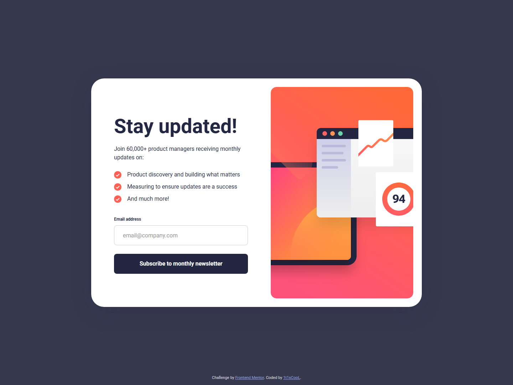
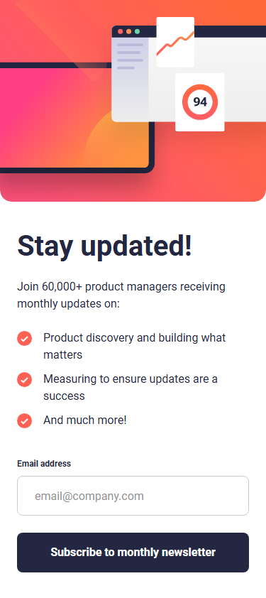

# Frontend Mentor - Newsletter sign-up form with success message solution

This is a solution to the [Newsletter sign-up form with success message challenge on Frontend Mentor](https://www.frontendmentor.io/challenges/newsletter-signup-form-with-success-message-3FC1AZbNrv). Frontend Mentor challenges help you improve your coding skills by building realistic projects.

## Table of contents

- [Overview](#overview)
  - [The challenge](#the-challenge)
  - [Screenshot](#screenshot)
  - [Links](#links)
- [My process](#my-process)
  - [Built with](#built-with)
  - [What I learned](#what-i-learned)
  - [Continued development](#continued-development)
  - [Useful resources](#useful-resources)
- [Development](#development)
- [Author](#author)

## Overview

### The challenge

Users should be able to:

- Add their email and submit the form
- See a success message with their email after successfully submitting the form
- See form validation messages if the field is empty or the email is malformed
- View the optimal layout depending on their device's screen size (375px / 1440px designs)
- See hover and focus states for all interactive elements on the page

### Screenshot

| Desktop                              | Mobile                             |
| ------------------------------------ | ---------------------------------- |
|  |  |

### Links

- Solution URL: [Vercel](https://newsletter-sign-up-with-success-message-main.vercel.app/)
- Live Site URL: [mmalabugin.ru/NewsletterSignUp](https://mmalabugin.ru/NewsletterSignUp/)

## My process

### Built with

- Semantic HTML5 markup
- CSS custom properties, Flexbox, desktop-first media queries
- **Vanilla TypeScript + Vite 7** — no UI framework; the app is assembled from FSD layers with small factory functions (`createX` / `mountX`)
- Feature-Sliced Design: `app` → `pages` → `widgets` → `features` → `shared`
- Local Roboto (`font-display: optional` + `<link rel="preload">`) to avoid font-swap layout shift
- Pixel anchors recovered from the design JPGs (card 928×641, illustration 400×593, mobile artboard height 284px)

### What I learned

- Without a framework, FSD still pays off: validation lives in `features/newsletter-subscribe`, while form/success cards stay in `widgets` and only talk through callbacks — the page owns the view state machine (`form` | `success`).
- Vite’s `%BASE_URL%` replacement in `index.html` keeps `@font-face` and preload URLs identical for `/` (Vercel) and `/NewsletterSignUp/` (self-hosted).
- Stretching the desktop illustration with `height: 100%` + `object-fit: cover` quietly added ~3px to the card; locking the SVG box to 400×593 restored the design height of 641px (24 + 593 + 24).
- Wrapping `transition` rules in `@media (prefers-reduced-motion: no-preference)` satisfies motion preferences without an `!important` reduced-motion reset that FM’s report flags.

### Continued development

- Persist the subscribed email in `sessionStorage` so a refresh on the success view does not bounce back to the form.
- Add a live region announcement when validation fails for screen-reader users who do not move focus.
- Explore a container-query version of the card so it can embed in narrower host layouts without relying on the viewport breakpoint.

### Useful resources

- [Vite: HTML env replacement](https://vite.dev/guide/env-and-mode.html#html-constant-replacement) — `%BASE_URL%` for fonts and favicon across deploy bases.
- [MDN: Constraint Validation](https://developer.mozilla.org/en-US/docs/Web/HTML/Constraint_validation) — why this form still uses a custom pattern (FM wants a specific error string and visual state).
- [Feature-Sliced Design](https://feature-sliced.design/) — layering UI widgets vs. subscribe validation logic.

## Development

```bash
npm install
npm run dev      # http://localhost:5173
npm run test     # vitest (unit + page flow)
npm run build    # tsc + vite build → dist/
```

Deploy convention: `main` targets Vercel (`base` in `vite.config.ts` stays commented). The `deploy` branch enables `base: '/NewsletterSignUp/'` and is built by Jenkins into a Docker image (nginx) deployed to Kubernetes behind the shared Traefik ingress (`ingresses` repo).

## Author

- Website - [mmalabugin.ru](https://mmalabugin.ru/)
- Frontend Mentor - [@1t1sCooL](https://www.frontendmentor.io/profile/1t1sCooL)
- Twitter - [@vi_el_mar](https://www.twitter.com/vi_el_mar)
- Telegram - [@ItIsCooL](https://t.me/ItIsCooL)
